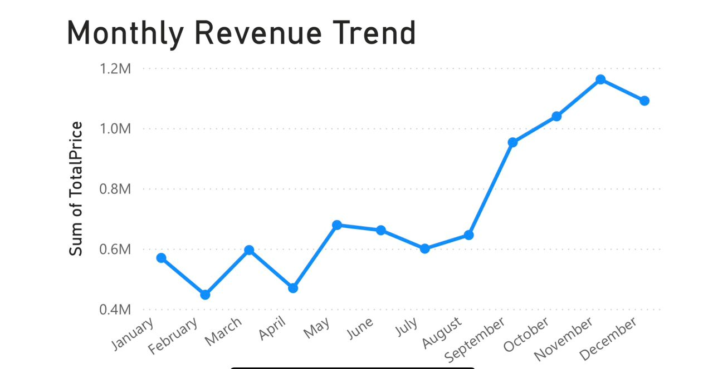
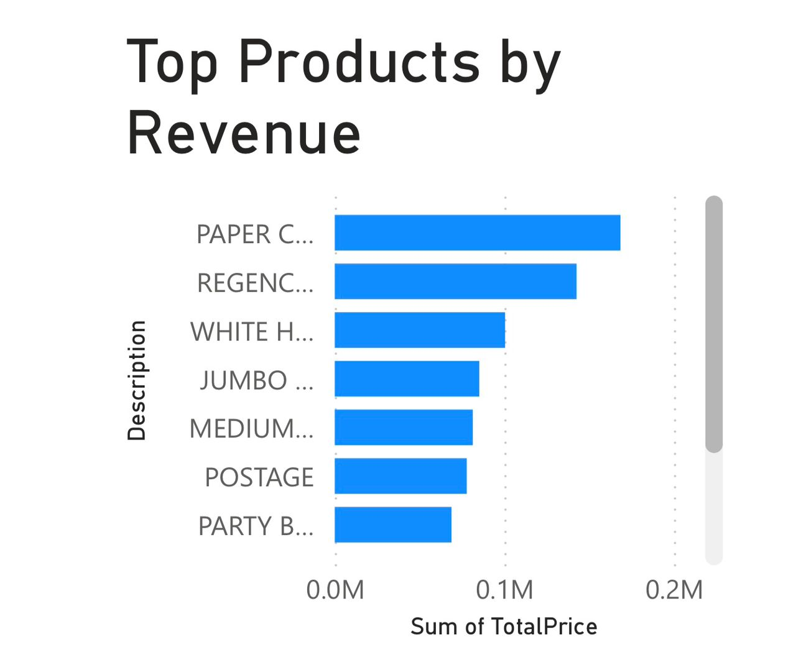
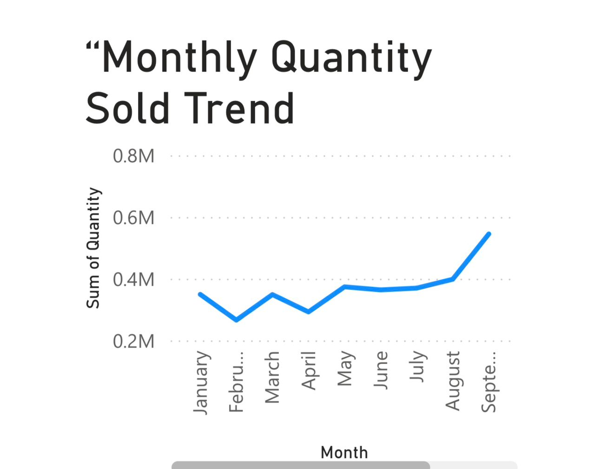
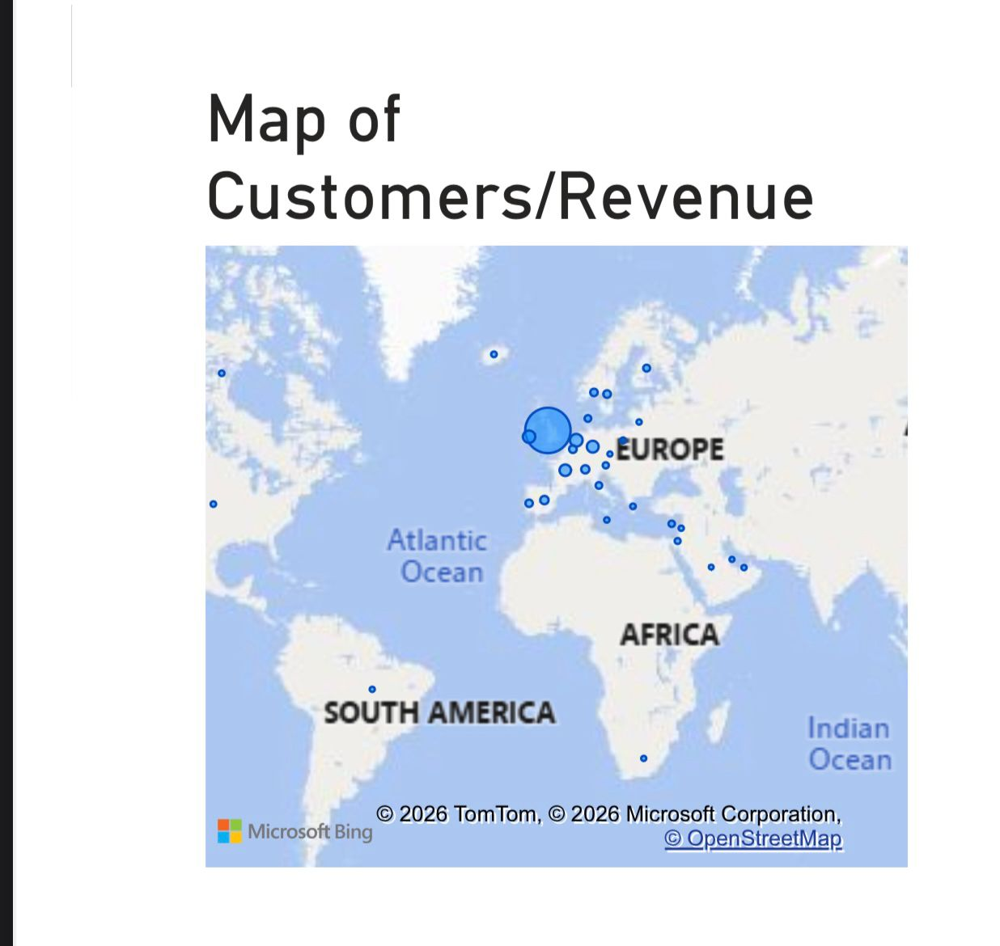

# E-commerce Customer Segmentation & Dashboard

## Overview
This project analyzes transactional data from an e-commerce retail business to uncover revenue drivers, customer behavior patterns, and growth opportunities. Using Python for data cleaning and RFM (Recency, Frequency, Monetary) segmentation, customers were classified into strategic groups: **Champions, Loyal Customers, Frequent Buyers, and At Risk customers**.  

An interactive **Power BI dashboard** was created to visualize sales performance, customer segments, product trends, and geographic distribution, providing actionable insights for business growth.

---

## Dataset
- **Transactions:** 397884 records  
- **Unique Customers:** 4338  
- **Countries:** 37  
- **Date Range:** 2010-12-01 – 2011-12-09 
- **Total Revenue:** [Currency]8,911,407.90 
- **Source:** Online Retail Dataset  


---

## Project Structure
```
Ecommerce_Customer_Segmentation/
│
├── Data/ # Raw and cleaned datasets
│ ├── raw/ # Original dataset
│ ├── cleaned/ # Cleaned dataset
│ └── customer_segments.csv # RFM segmentation results
├── Notebooks/ # Python notebooks
│ ├── Data_Cleaning.ipynb
│ └── RFM_Segmentation.ipynb
├── PowerBI/ # Power BI dashboard file (.pbix)
├── Reports/ # Executive_Summary.md
├── Assets/ # Images/screenshots
└── README.md # Project overview
```

---

## Workflow / Methodology
1. **Data Cleaning & Preprocessing:**  
   - Remove duplicates, canceled orders, and null values  
   - Calculate `TotalPrice = Quantity × UnitPrice`  

2. **Exploratory Data Analysis (EDA):**  
   - Total revenue 
   - Top countries by revenue  
   - Monthly sales trend 

3. **RFM Customer Segmentation:**  
   - Recency: Days since last purchase  
   - Frequency: Total number of purchases  
   - Monetary: Total spend  
   - Classify customers into **Champions, Loyal Customers, Frequent Buyers, At Risk, Others**  

4. **Power BI Dashboard Development:**  
   - Interactive visuals with KPI cards, line charts, bar charts, pie charts, maps, and tables  
   - Filters/slicers for Country, Month, Product, and Segment  

---

## Power BI Dashboard Pages
- **Page 1: Executive Overview** – Key metrics and high-level business overview  
- **Page 2: Sales Insights** – Revenue trends, and top countries  
- **Page 3: Customer Insights (RFM)** – RFM-based customer groups and revenue contribution  
- **Page 4: Product Insights** – Top products and sales trends  
- **Page 5: Geographic Insights** – Revenue and customer distribution by country  
- **Page 6: Key Insights & Recommendations** – Actionable strategies for business growth  

---

## Executive Summary
This project analyzes transactional data to identify key revenue drivers and understand customer purchasing behavior. Using Python for data cleaning and RFM segmentation, customers were classified into strategic groups: **Champions, Loyal Customers, Frequent Buyers, and At Risk customers**.  

A small segment of high-value customers contributes a significant portion of total revenue, emphasizing the importance of **retention and loyalty strategies**. Revenue trends show clear temporal patterns, and product-level insights highlight top-performing items generating the highest sales volume and revenue.  

The interactive **Power BI dashboard** visualizes sales performance, customer segments, product demand, and regional contributions, enabling **data-driven decisions**, targeted marketing, improved customer engagement, and overall business growth.

---

## Recommendations
- **Reward Champions:** Implement VIP programs and exclusive discounts  
- **Re-engage At Risk Customers:** Personalized promotions to reduce churn  
- **Promote Top Products:** Focus marketing campaigns on high-revenue products in top-performing countries  
- **Use Segmentation:** Optimize marketing strategies for different customer groups  

---

## Power BI Screenshots
### Page 1 – Executive Overview


### Page 2 – Sales Insights



### Page 3 – Customer Insights (RFM)


### Page 4 – Product Insights



### Page 5 – Geographic Insights



### Page 6 – Key Insights & Recommendations


---

## How to Explore
1. Open notebooks in `Notebooks/` to view Python analysis.  
2. Open `Ecommerce_Customer_Dashboard.pbix` in `PowerBI/` to explore the interactive dashboard.  
3. View screenshots in `Assets/images/` for a quick visual overview.

---

## Author
*Muktar Bello*  
*22 February 2026*

## License
MIT License
